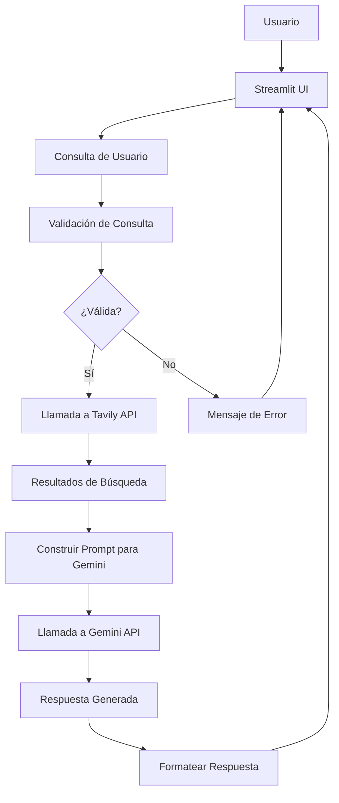
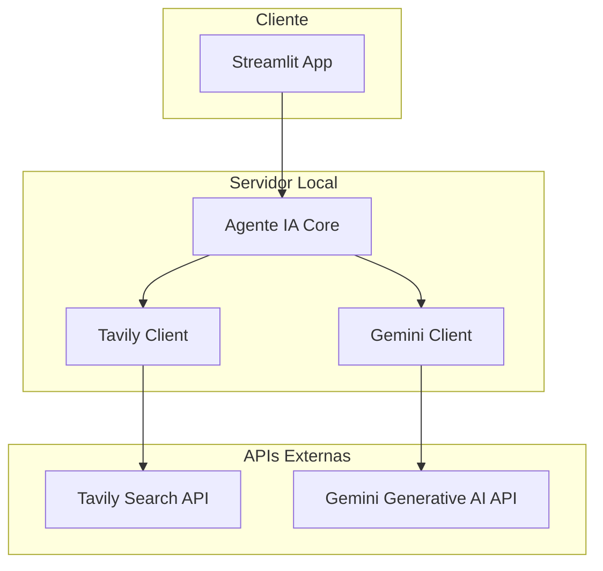

# Arquitectura del Sistema: Agente IA en Psicología y Relaciones de Pareja

## Visión General
La arquitectura sigue un patrón de aplicación web simple con separación de responsabilidades. El frontend es manejado por Streamlit, el backend lógico en Python puro, y las integraciones con APIs externas.

## Componentes Principales

### 1. Interfaz de Usuario (Streamlit)
- **Responsabilidades**: Recibir entrada del usuario, mostrar respuestas, manejar estado de la app.
- **Tecnologías**: Streamlit framework.

### 2. Lógica del Agente IA
- **Módulo de Procesamiento**: Valida consultas, coordina llamadas a APIs.
- **Integración Tavily**: Maneja búsquedas web.
- **Integración Gemini**: Genera respuestas basadas en prompts.

### 3. APIs Externas
- **Tavily API**: Para búsqueda de información relevante.
- **Gemini API**: Para generación de texto experto.

### 4. Almacenamiento (Opcional)
- **Historial**: Archivo local o base de datos simple para conversaciones (futuro).

## Flujo de Datos



## Diagrama de Arquitectura de Alto Nivel



## Consideraciones Técnicas
- **Separación de Concerns**: Cada módulo tiene una responsabilidad única.
- **Configuración**: Usar variables de entorno para API keys.
- **Manejo de Errores**: Try-except en llamadas a APIs, fallback a respuestas genéricas.
- **Escalabilidad**: Para múltiples usuarios, considerar despliegue en cloud con sesiones.
- **Seguridad**: No exponer API keys, validar inputs para prevenir inyección.

## Estructura de Proyecto Propuesta
```
mind_heart_ai/
├── app.py              # Archivo principal de Streamlit
├── agent.py            # Lógica del agente IA
├── tavily_client.py    # Cliente para Tavily API
├── gemini_client.py    # Cliente para Gemini API
├── utils.py            # Utilidades (validación, formateo)
├── requirements.txt    # Dependencias Python
├── .env                # Variables de entorno (API keys)
├── api_research.md     # Documentación de APIs
├── requirements.md     # Requisitos funcionales
└── README.md           # Documentación del proyecto